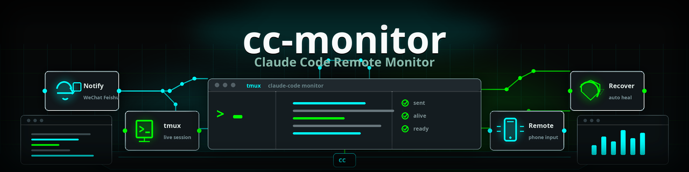

<p align="center">
  
</p>

<p align="center">
  
  
  
</p>

```
  你的电脑 (tmux)                       你的手机/手表
┌─────────────────────┐             ┌──────────────┐
│  ✶ 重构登录模块…     │── 通知 ───→│  📱 微信/飞书  │ ← 查看详情
│  (Claude 在跑)       │             │  ⌚ 钉钉      │ ← 手腕震动提醒
│                      │             └──────────────┘
│                      │← 远程输入 ──  📱 发消息控制 Claude
└─────────────────────┘
```

<p align="center">
  <strong>Claude Code 远程监控与控制</strong><br>
  任务完成自动通知 · 会话卡死自动恢复 · 手机远程发命令
</p>

---

> Claude Code 跑任务，你人不在电脑前——任务完成了不知道？会话卡死了没人管？权限弹窗挡着流程？
>
> cc-monitor 解决这些问题。装一次，Claude Code 的每一步都在你掌控中。

## 快速体验

把下面这段话**复制粘贴**给你的 Claude Code：

```text
请帮我安装 cc-monitor —— Claude Code 远程监控工具。步骤如下：
1. git clone https://github.com/veniai/cc-monitor.git ~/cc-monitor
2. cd ~/cc-monitor && bash install.sh --interactive
3. 按提示选择模式（直连零依赖，或龙虾模式支持微信远程输入）并配置通知渠道
4. 验证安装：echo '{"hook_event_name":"Stop","last_assistant_message":"测试"}' | bash ~/cc-monitor/cc-monitor.sh hook
安装完成后，告诉我 cc-monitor 提供了哪些功能。
```

<details>
<summary>手动安装</summary>

```bash
git clone https://github.com/veniai/cc-monitor.git ~/cc-monitor
cd ~/cc-monitor

# 交互式安装
./install.sh --interactive

# 或指定模式
./install.sh --mode direct --enable-watchdog      # 直连模式（零依赖）
./install.sh --mode openclaw --enable-watchdog     # 龙虾模式（微信远程输入）
```

</details>

## 核心亮点

**任务完成通知** — Claude Code 任务完成或出错时，自动推送到微信、飞书、钉钉。钉钉直达手表/手环，手腕一震就知道

**自动恢复** — API 报错自动重试；检测到 5 小时配额限额后解析重置时间，到点自动恢复，无需人工干预

**远程输入** — 通过 [OpenClaw（龙虾）](https://github.com/veniai/openclaw) 在微信/飞书上直接发消息控制 Claude Code。手机就是遥控器

**卡死检测** — Watchdog 每 5 分钟扫描 tmux 会话，20 分钟无进展自动恢复（三道防线：token 不变、等待超时、屏幕冻结），最多自动恢复 2 次后只告警

**权限自动批准** — 安全工具的权限请求自动批准，其余通知用户、超时自动放行，不卡流程

**双模式** — 直连模式只要 webhook URL 零依赖；龙虾模式通过 OpenClaw 获得微信远程输入完整功能

## 通知渠道

| 渠道 | 模式 | 能力 |
|------|------|------|
| 钉钉 | 直连 | 强通知（手表/手环震动） |
| 飞书 | 直连 | IM 通知 |
| 微信 | 龙虾 | IM 通知 + 远程输入 |
| 飞书 | 龙虾 | IM 通知 + 远程输入 |

> 钉钉始终走 webhook 直连——它是专用强通知通道，发短消息到手表，手腕一震就知道任务完成。微信/飞书是日常聊天工具，拿来震手腕会太吵。

## 使用场景

| 场景 | cc-monitor 做什么 |
|------|------------------|
| 让 Claude Code 跑长任务 | 任务完成/出错自动通知到手机 |
| 不在电脑前 | 手机微信直接发消息给 Claude |
| 会话卡死没人管 | Watchdog 自动检测并恢复 |
| API 配额用完 | 检测限额时间，到点自动恢复 |
| Claude Code + Codex 同时用 | 双工具监控，同一套通知渠道 |

<details>
<summary>Hook 事件详解</summary>

Claude Code / Codex CLI 内置 hook 机制，在关键生命周期节点自动触发：

| 事件 | 行为 |
|------|------|
| **Stop** | 任务正常完成 → 发送完成通知 |
| **StopFailure** | API 报错 → 自动恢复；配额限额 → 解析重置时间，暂停重试，到时间自动恢复 |
| **PermissionRequest** | 权限请求 → 安全工具自动批准，其余通知用户，超时自动批准 |
| **SessionEnd** | 会话结束 → 清理状态 |

</details>

<details>
<summary>前置依赖</summary>

- **Claude Code**（CLI 工具）
- **tmux** — 终端复用器
- **jq** — JSON 处理器
- **grep -P** — Perl 正则（GNU grep）
- **bash 4+**
- **python3**（可选，钉钉加签需要）
- **openclaw** CLI（仅龙虾模式需要）

平台：**Linux** 或 **WSL**。

</details>

<details>
<summary>配置</summary>

复制 `config.example.conf` 到 `~/.config/cc-monitor/config.conf`。

**直连模式：**

```ini
[monitor]
mode=direct

[channel:dingtalk]
enabled=true
webhook=https://oapi.dingtalk.com/robot/send?access_token=xxx
secret=
```

**龙虾模式：**

```ini
[monitor]
mode=openclaw

[channel:dingtalk]
enabled=true
webhook=https://oapi.dingtalk.com/robot/send?access_token=xxx

[channel:wechat]
enabled=true
openclaw_channel=openclaw-weixin
openclaw_account=你的account
openclaw_target=你的target@im.wechat
```

环境变量覆盖：`CC_MONITOR_<SECTION>_<KEY>`

</details>

<details>
<summary>架构</summary>

```
cc-monitor.sh           # 唯一入口
├── lib/
│   ├── config.sh       # 配置加载（INI + 环境变量 + 双模式）
│   ├── hooks.sh        # CC/Codex hook 处理器
│   ├── watchdog.sh     # 卡住检测 + 自动恢复
│   ├── tmux.sh         # tmux 工具函数
│   ├── notify.sh       # 通知分发（遍历启用的 channels）
│   └── marker.sh       # 会话状态文件
├── channels/           # 通知渠道插件
│   ├── dingtalk.sh     # 钉钉 webhook（强通知）
│   ├── feishu-openclaw.sh  # 飞书 openclaw（龙虾模式）
│   ├── wechat.sh       # 微信 openclaw（龙虾模式）
│   └── _template.sh    # 新渠道模板
├── templates/          # OpenClaw workspace 模板
└── docs/
    └── plans/          # 开发计划
```

添加新渠道：复制 `channels/_template.sh` → 实现 `channel_send()` → 添加配置 section → 完成

</details>

<details>
<summary>卸载</summary>

```bash
./install.sh --uninstall
```

</details>

## 相关项目

- **[codesop](https://github.com/veniai/codesop)** — AI 编码工作流操作系统。让 Claude Code 拥有 SOP 纪律：自动选 Skill、编排长任务、每步验证。搭配 cc-monitor 使用：codesop 编排 workflow，cc-monitor 在手机上帮你盯着
- **[OpenClaw（龙虾）](https://github.com/veniai/openclaw)** — IM 桥接平台，提供微信/飞书双向通信
- **[Claude-to-IM](https://github.com/veniai/Claude-to-IM-skill)** — Claude Code 桥接到 IM 平台

## License

[MIT](LICENSE)
